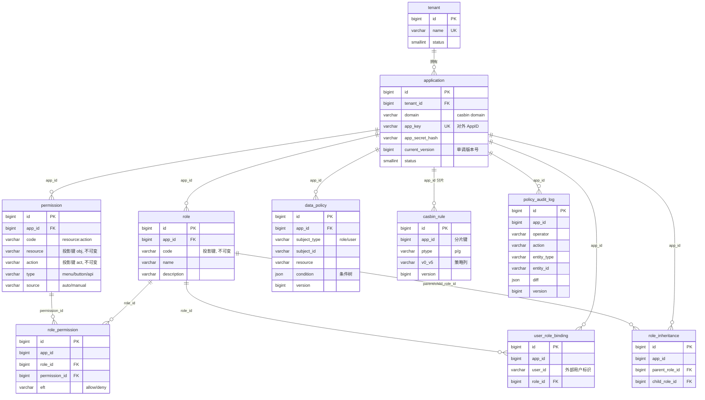

# 司域 (Sydom) 数据库 Schema 详细设计

> 厘定辖域，权归其位
>
> 版本：v0.1 | 日期：2026-05-31 | 状态：草稿
>
> 上游：[整体架构设计](2026-05-30-sydom-architecture-design.md)

---

## 1. 范围与定位

本文档是司域**控制面持久化存储**的数据库 Schema 详细设计，是详细设计阶段的第一个子项目。它定义控制面的全部业务表、casbin 策略投影表、审计表，以及版本号机制与写入事务时序。

**不在本文档范围内**（留给后续各自的 spec）：

- 控制面管理 API、Policy Manager 内部结构、DB BatchAdapter 的具体实现
- gRPC 策略下发协议契约（delta / 心跳 / 全量快照拉取的 proto）
- Sidecar 内部结构（MemoryAdapter、SyncedCachedEnforcer 封装、数据权限引擎）
- SDK 接口规范

本文档只回答："控制面用什么样的表结构存策略数据，如何投影成 casbin 可加载的 policy，如何保证版本单调与变更可追溯。"

---

## 2. 设计决策（本设计的五条主线）

以下五条决策已在头脑风暴中逐条确认，是本 Schema 的根基：

1. **子项目边界**：本轮只设计数据库 Schema。
2. **双层模型**：规范化业务表是策略的**唯一真相源**，casbin policy（`p`/`g` 行）由业务表**投影**产生，不手工维护。对齐架构 3.4 节"casbin 是计算内核，不是领域模型"。
3. **物化派生表**：投影产物 `casbin_rule` **物化落库**，作为下发源与全量快照的读取面。**不设独立的 delta 重放表**——丢包兜底靠"全量快照拉取"（架构 R10），delta 只在变更事务后现算并推一次。
4. **租户隔离**：共享库共享表 + `app_id` 列逻辑隔离。对齐架构 I2"服务端按凭据归属强制 app_id"。
5. **单一 model**：全局锁定一套 RBAC-with-domain model（架构 6.2），不支持每 app 自定义 `.conf`。ACL（`p.sub` 存 user 的特例）、RBAC、ABAC（独立 DataPolicy 条件树）均被覆盖。

---

## 3. ER 图



> 说明：司域**不建 user 主数据表**。`user_role_binding.user_id` 只存业务系统的用户标识字符串。用户的认证与主数据由业务系统负责，司域只管"这个用户标识拥有哪些角色"。

---

## 4. 表定义

类型用通用写法，PG/MySQL 方言差异见第 7 节。所有表的 `created_at` / `updated_at` 为 `timestamp`（UTC）。

### 4.1 治理层

```sql
-- 租户
tenant
  id            bigint PK
  name          varchar(128)  NOT NULL
  status        smallint      NOT NULL DEFAULT 1   -- 1 启用 / 0 停用
  created_at, updated_at  timestamp
  UNIQUE(name)

-- 应用（= casbin domain）
application
  id                bigint PK
  tenant_id         bigint NOT NULL → tenant.id
  domain            varchar(64)  NOT NULL   -- casbin domain 值，投影进 v1；默认可等于 app_key
  name              varchar(128) NOT NULL
  app_key           varchar(64)  NOT NULL   -- 对外 AppID
  app_secret_hash   varchar(255) NOT NULL   -- AppSecret 仅存哈希；明文创建时返回一次
  current_version   bigint NOT NULL DEFAULT 0  -- 单调版本号，见第 6 节
  status            smallint NOT NULL DEFAULT 1
  created_at, updated_at
  UNIQUE(app_key)
  UNIQUE(tenant_id, domain)
```

### 4.2 主体与授权层

```sql
-- 角色
role
  id            bigint PK
  app_id        bigint NOT NULL → application.id
  code          varchar(64)  NOT NULL   -- 投影进 g/p 的 sub；创建后不可变（投影键）
  name          varchar(128) NOT NULL   -- 展示名，可变
  description   varchar(512)
  created_at, updated_at
  UNIQUE(app_id, code)

-- 权限点注册表
permission
  id            bigint PK
  app_id        bigint NOT NULL → application.id
  code          varchar(255) NOT NULL   -- {resource}:{action}，展示用
  resource      varchar(128) NOT NULL   -- 投影进 p 的 obj；创建后不可变（投影键）
  action        varchar(64)  NOT NULL   -- 投影进 p 的 act；创建后不可变（投影键）
  type          varchar(16)  NOT NULL   -- menu / button / api
  name          varchar(128) NOT NULL
  description   varchar(512)
  source        varchar(8)   NOT NULL DEFAULT 'manual'  -- auto（SDK 上报）/ manual（UI 创建）
  created_at, updated_at
  UNIQUE(app_id, code)

-- 角色→权限点授权（→ p 行）
role_permission
  id            bigint PK
  app_id        bigint NOT NULL
  role_id       bigint NOT NULL → role.id
  permission_id bigint NOT NULL → permission.id
  eft           varchar(8) NOT NULL DEFAULT 'allow'  -- allow / deny（对齐 6.2 effect）
  created_at
  UNIQUE(app_id, role_id, permission_id)

-- 角色继承 role→role（→ g 行）
role_inheritance
  id              bigint PK
  app_id          bigint NOT NULL
  parent_role_id  bigint NOT NULL → role.id   -- 被继承（权限来源）
  child_role_id   bigint NOT NULL → role.id   -- 继承者
  created_at
  UNIQUE(app_id, parent_role_id, child_role_id)

-- 用户→角色绑定（→ g 行）
user_role_binding
  id            bigint PK
  app_id        bigint NOT NULL
  user_id       varchar(128) NOT NULL   -- 业务系统用户标识，司域不建 user 表
  role_id       bigint NOT NULL → role.id
  created_at
  UNIQUE(app_id, user_id, role_id)
```

> **投影键不可变约束**：`role.code`、`permission.resource`、`permission.action` 是投影进 casbin policy 的键，**创建后不可修改**。改名只动 `name`/`description`（展示字段）。这样投影键稳定，避免改一个 code 就要级联重算全部引用它的 `casbin_rule` 行。若确需改 code，按"删旧建新"处理（业务层禁止，仅 DBA 介入）。

> **角色继承环防护**：`UNIQUE(app_id, parent_role_id, child_role_id)` 只能防重复边，**不能防环**（如 A→B→A）。环会导致 casbin 角色图 matcher 死循环（架构 3.3）。环检测由控制面在写入事务前调用 `detector.Check()` 完成（架构 3.1），是控制面写入逻辑，不在表约束层。本表只保证边唯一。

> **g 命名空间提示**：casbin 的 `g` 段把"用户"与"角色"放在同一命名空间。若某 `user_id` 恰好等于某 `role.code`，两者在 casbin 角色图中会被视为同一节点。这是 casbin 固有行为，控制面应在分配/上报时规避（如给角色 code 统一前缀），不在本表约束层处理。

### 4.3 数据权限层

```sql
-- 数据权限策略（条件树，不投影进 casbin）
data_policy
  id            bigint PK
  app_id        bigint NOT NULL → application.id
  subject_type  varchar(8)   NOT NULL   -- 'role'（主用）/ 'user'
  subject_id    varchar(128) NOT NULL   -- role.code 或 user_id
  resource      varchar(128) NOT NULL   -- 资源类型，如 order
  condition     json         NOT NULL   -- 条件树，见 4.3.1
  description   varchar(512)
  version       bigint       NOT NULL   -- 纳入 app 同一条版本号序列（架构 6.4）
  created_at, updated_at
  INDEX(app_id, subject_type, subject_id)
  INDEX(app_id, resource)
```

`data_policy` 的主体解析复用 casbin 角色图：Sidecar 求值时先 `GetImplicitRolesForUser(user, dom)` 展开用户为隐式角色集，再取挂在这些角色（`subject_type='role'`）上的策略（架构 6.3 / 6.4）。`subject_type='user'` 是直接挂用户的特例。

#### 4.3.1 condition 条件树结构

`condition` 列存储结构化条件树（对齐架构 6.3）。JSON 形态：

```json
{
  "op": "AND",
  "children": [
    { "field": "department", "op": "EQ", "value": "$user.department" },
    { "field": "status",     "op": "IN", "value": ["pending", "approved"] }
  ]
}
```

- **逻辑节点**：`op` ∈ `AND` / `OR`，带 `children` 数组。
- **比较节点**：`field`（资源字段）、`op` ∈ `EQ` / `NE` / `IN` / `GT` / `GE` / `LT` / `LE` / `LIKE`、`value`（字面量、数组，或 `$user.xxx` 运行时变量）。
- `$user.xxx` 为运行时变量，Sidecar 求值时从请求的 `user_attrs` 取值，**作为参数**填入渲染结果（架构 I3 参数化，杜绝 SQL 注入），不进入 SQL 文本。
- condition 的完整 JSON Schema 校验与方言渲染规则属于 Sidecar 数据权限引擎，本文档只定义存储形态。

### 4.4 派生表（投影产物）

```sql
-- casbin policy 物化投影表；唯一真相源是业务表，此表由投影重算生成
casbin_rule
  id       bigint PK
  app_id   bigint NOT NULL       -- 分片键，对齐 FilteredAdapter 按 domain 拉取
  ptype    varchar(8)  NOT NULL  -- 'p' / 'g'
  v0..v5   varchar(128) NOT NULL DEFAULT ''   -- 空位用空串（casbin 惯例，非 NULL）
  version  bigint NOT NULL       -- 该行最后写入时的 app current_version
  INDEX(app_id, ptype)
  INDEX(app_id, version)
  UNIQUE(app_id, ptype, v0, v1, v2, v3, v4, v5)   -- 去重
```

### 4.5 审计层

```sql
-- 策略变更审计（架构第 10 节：操作人 / 时间 / diff）
policy_audit_log
  id            bigint PK
  app_id        bigint NOT NULL
  operator      varchar(128) NOT NULL   -- 操作人（控制面管理员标识）
  action        varchar(16)  NOT NULL   -- create / update / delete
  entity_type   varchar(32)  NOT NULL   -- role / permission / role_permission /
                                        -- user_role_binding / role_inheritance / data_policy
  entity_id     varchar(128)            -- 受影响业务实体 id（删除时为原 id）
  diff          json                    -- { "before": {...}, "after": {...} }
  version       bigint NOT NULL         -- 本次变更产生的 app version
  created_at    timestamp NOT NULL
  INDEX(app_id, created_at)
  INDEX(app_id, version)
  INDEX(app_id, entity_type, entity_id)
```

审计表是只追加（append-only）的，不更新、不删除。它服务"谁在何时改了什么"，**不**承担丢包恢复职责（恢复靠全量快照）。

---

## 5. 投影规则（业务表 → casbin_rule）

对应架构 6.2 model：`p = sub, dom, obj, act, eft` / `g = _, _, _`（user/role/domain）。

| 来源（均 JOIN application 取 domain） | ptype | v0 | v1 | v2 | v3 | v4 |
|---|---|---|---|---|---|---|
| `role_permission` ⋈ role ⋈ permission | `p` | `role.code` (sub) | `app.domain` (dom) | `perm.resource` (obj) | `perm.action` (act) | `rp.eft` |
| `user_role_binding` ⋈ role | `g` | `urb.user_id` (user) | `role.code` (role) | `app.domain` (dom) | `''` | `''` |
| `role_inheritance` ⋈ role(parent/child) | `g` | `child.code` | `parent.code` | `app.domain` | `''` | `''` |

**casbin `g` 语义对齐**（对照架构 6.2）：`g(A, B, dom)` = "A 拥有 / 继承 B"。

- `g(user_id, role.code, domain)`：用户拥有角色。
- `g(child.code, parent.code, domain)`：子角色继承父角色的权限。

两类 `g` 行同表共存，靠 v0/v1 的语义区分，casbin 角色图（`RoleManagerImpl`）天然支持混合。

`data_policy` **不参与投影**，由 Sidecar 数据权限引擎独立加载求值。

---

## 6. 版本号机制与写入事务时序

`application.current_version` 是 per-app 的单调递增整数，是架构 R3 心跳对账、丢包检测、增量下发的基础。每一次策略变更（任意业务表的增删改）都走统一的写入事务：

```
BEGIN
  1. SELECT current_version FROM application WHERE id = :app_id FOR UPDATE   -- 行锁，串行化本 app 变更
  2. v_new := current_version + 1
  3. 业务表 CUD（role / permission / role_permission /
                 user_role_binding / role_inheritance / data_policy）
  4. 重算受影响的投影行：
       - 功能权限类变更 → 增删改对应 casbin_rule 行，写入 version = v_new
       - data_policy 变更   → 更新 data_policy.version = v_new（不动 casbin_rule）
       - 事务内把本次增删的行集（add[] / remove[]）收集到内存，供步骤 7 下发
  5. UPDATE application SET current_version = v_new WHERE id = :app_id
  6. INSERT policy_audit_log（version = v_new, operator, action, entity, diff）
COMMIT
  7. 事务提交后下发本次 delta（含 v_new）：
       - PUBLISH 到 Redis 频道 policy-change:{app_id}
       - 推送给控制面持有的 gRPC stream
     下发失败不回滚（DB 已是真相源），靠版本号 + 心跳对账兜底（架构 R3 / R10）
```

要点：

- **并发控制**：步骤 1 的 `FOR UPDATE` 行锁保证同一 app 的版本号严格单调、变更串行化；跨 app 无锁竞争，控制面多副本可并发处理不同 app。
- **delta 不持久化**：本次 add/remove 行集只在内存中算一次用于下发（步骤 7），不写重放日志。丢包后 Sidecar 通过全量快照拉取对齐（架构 R10）。
- **快照来源**：全量快照拉取直接 `SELECT * FROM casbin_rule WHERE app_id = ?`（+ `data_policy`），配 `application.current_version` 一并返回。
- **幂等上报**：权限点 SDK 自动上报为幂等 upsert（架构 8 节 M1，按 `app_id + permission.code` 去重），重复上报不产生脏数据、不无谓地推高版本号（无实际变更则不进写入事务）。

---

## 7. PG / MySQL 兼容性

控制面数据库可配置为 PostgreSQL 或 MySQL（架构第 12 节）。Schema 走两者兼容的子集，差异由 migration 层吸收：

| 维度 | PostgreSQL | MySQL | 处理 |
|---|---|---|---|
| 主键自增 | `GENERATED ALWAYS AS IDENTITY` | `AUTO_INCREMENT` | migration 工具按方言生成；均为 `bigint` |
| JSON 列 | `jsonb` | `json` | 统一逻辑类型 `json`，建表时映射 |
| 时间戳 | `timestamptz` | `datetime`(UTC) | 应用层统一按 UTC 读写 |
| 字符集 | 默认 UTF-8 | `utf8mb4` | MySQL 建库强制 `utf8mb4` |
| 行锁 | `SELECT ... FOR UPDATE` | `SELECT ... FOR UPDATE` | 两者一致，第 6 节时序通用 |
| 布尔/状态 | `smallint` | `smallint` | 统一 `smallint`，避免 `boolean` 方言差异 |

主键策略 MVP 采用 **DB 自增 bigint**（最简单）；若将来分库需要全局唯一，再切换为应用层雪花 ID，业务表外键语义不变。

---

## 8. 边界与未决（留给后续 spec）

- **控制面是否常驻 enforcer**：循环继承检测（`detector.Check`）、决策解释预览等是否需要控制面持有 casbin enforcer 实例，属于控制面内部设计，在控制面 spec 中决定。本表结构已能支撑两种选择。
- **DB BatchAdapter 实现细节**：如何把 `casbin_rule` 读成 casbin model、`LoadFilteredPolicy` 的 filter 形态，属于控制面 spec。
- **gRPC 下发契约**：delta / 心跳 / 全量快照拉取的 proto 定义与语义，属于 gRPC 同步协议 spec。
- **condition 条件树的校验与方言渲染**：属于 Sidecar 数据权限引擎 spec。

---

*下一步：按头脑风暴排序推进下一个子项目（gRPC 同步协议契约 → 控制面 → Sidecar → SDK）。*
