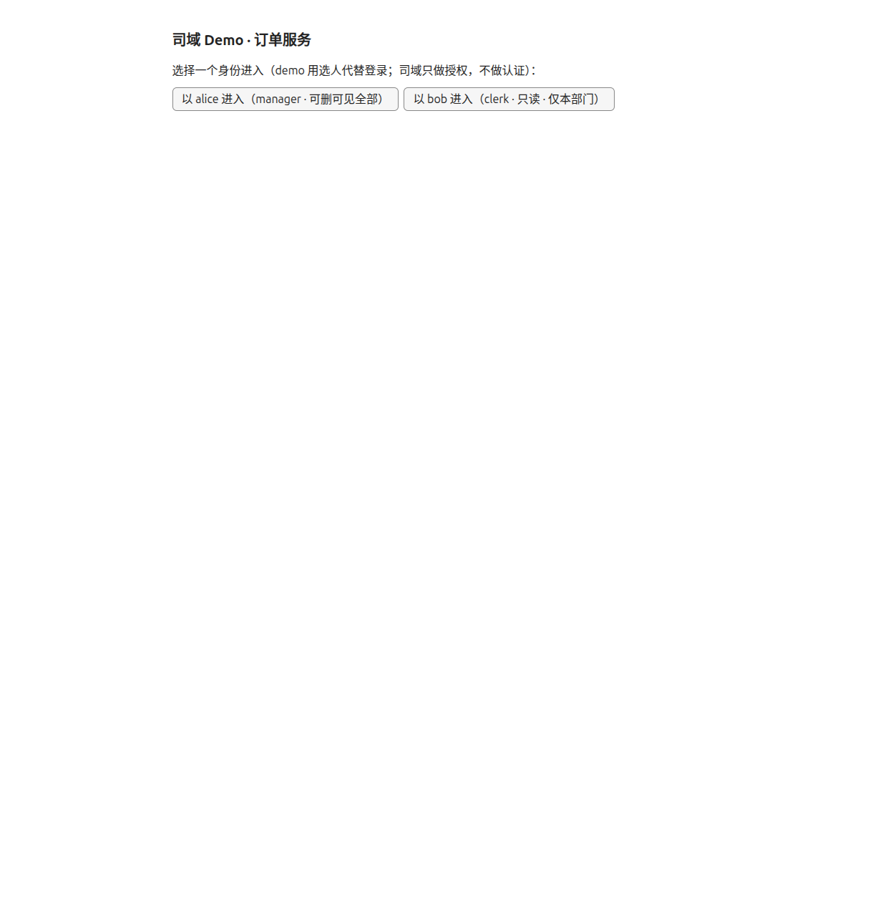
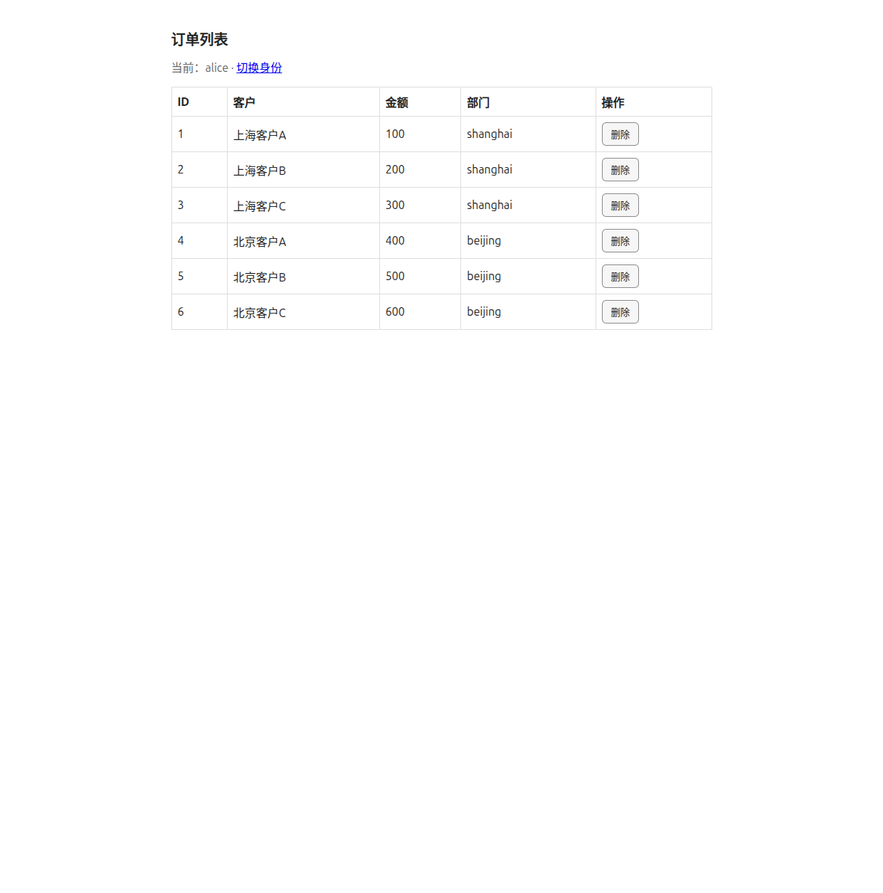
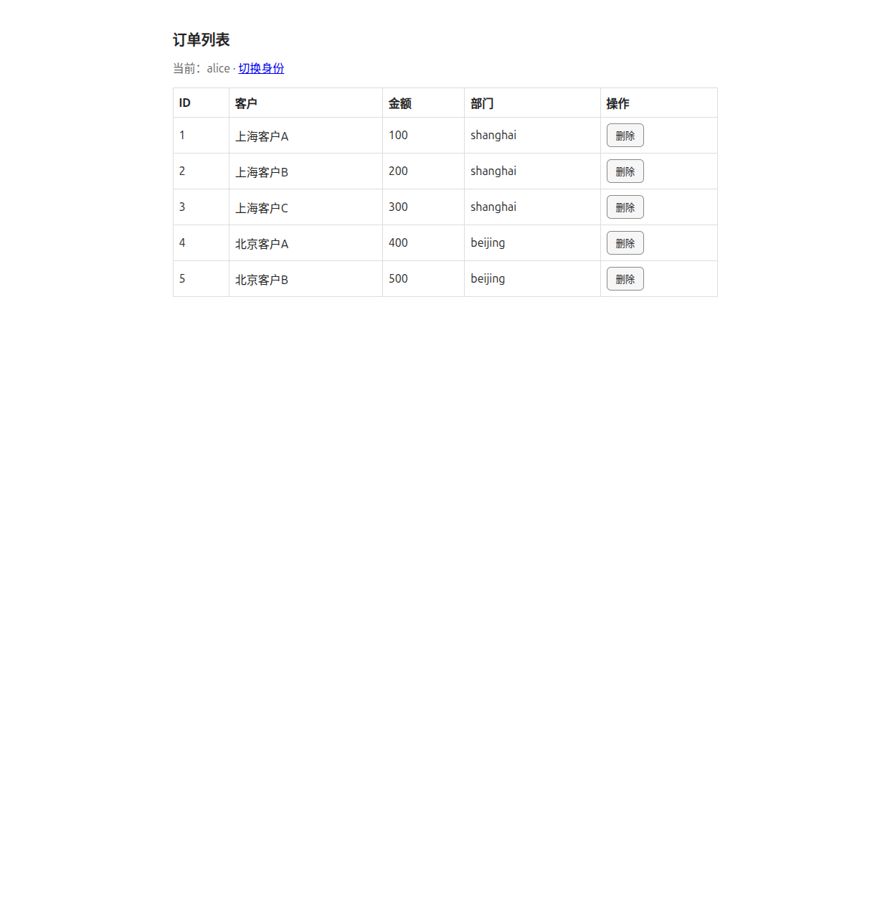
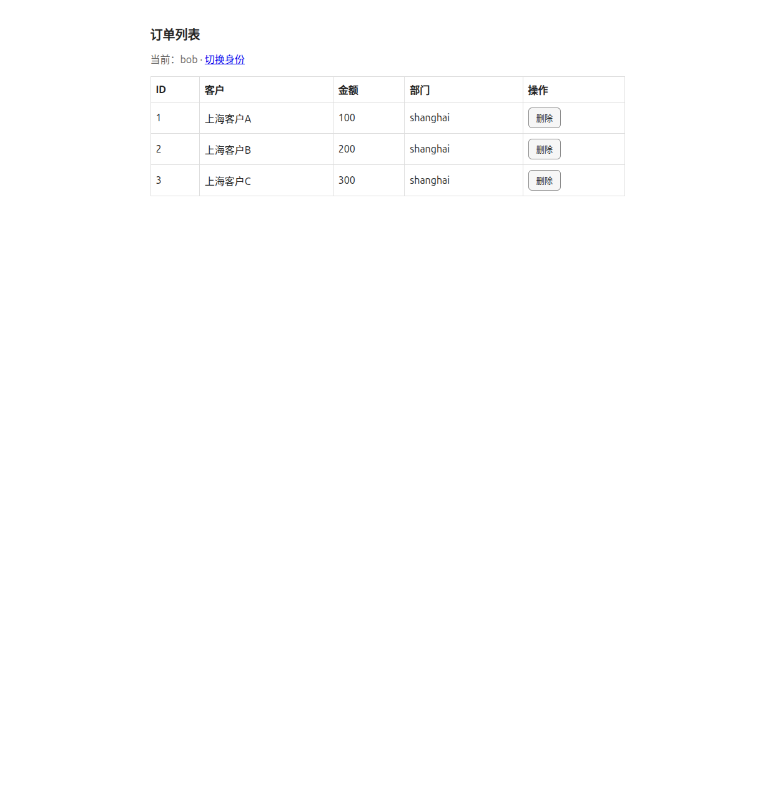
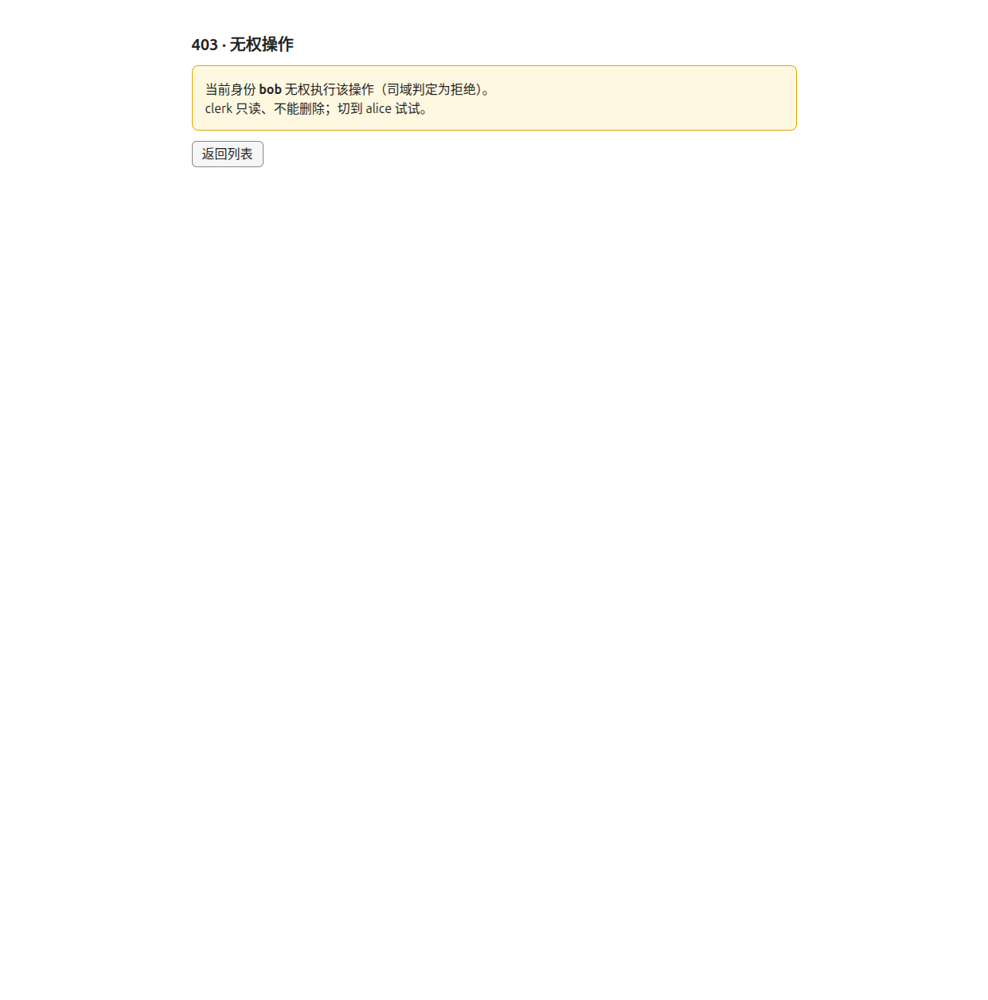
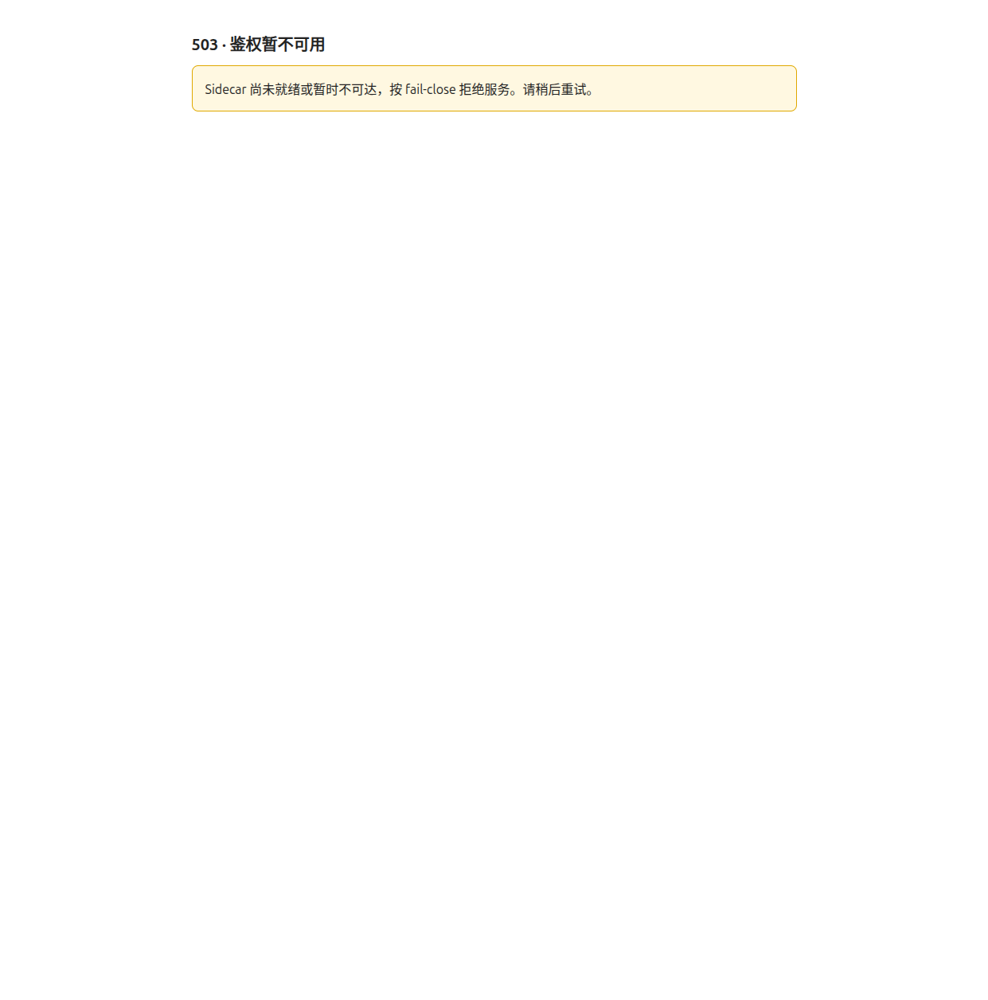

# 司域 Demo · 人用走查（Human Walkthrough）

本文用截图记录一次**真人在浏览器里**对 `examples/orderservice` 订单服务的完整走查，
逐屏印证司域（Sydom）的三件事：**功能权限**、**数据权限**、**fail-close**。

> 订单服务只通过**公开 SDK**（`sydom` / `sydomhttp` / `sydomsql`）接入司域，不依赖任何
> 项目内部包。鉴权链路：订单服务 → Sidecar →（HMAC）控制面 → PostgreSQL/Redis。

## 角色与策略（由 seeder 供应）

| 用户 | 角色 | 功能权限 | 数据策略 | 直观效果 |
|---|---|---|---|---|
| **alice** | manager | read / write / **delete** | `dept IN [shanghai, beijing]` | 看到全部订单，可删除 |
| **bob** | clerk | read（只读） | `dept EQ $user.department`（bob→shanghai） | 仅见本部门订单，删除被拒 |

种子数据 6 单：上海 3 单（100/200/300）、北京 3 单（400/500/600）。

## 如何复现

```bash
make demo          # 起全栈（compose）：PG + Redis + 控制面 + seeder + Sidecar + 订单服务
# 浏览器打开 http://localhost:8080，用 alice / bob 对比
make smoke         # 可选：HTTP 冒烟（1×allow + 1×deny + 1×数据过滤）
make demo-down     # 拆栈（清容器与卷）
```

> 若本机已占用 6379/5432 等端口，在 `deploy/.env.demo` 里取消注释对应 `*_HOST_PORT`
> 改用空闲端口即可（例如 `REDIS_HOST_PORT=16379`）。

---

## 走查记录

### ① 落地页 —— 选身份（司域只做授权，不做认证）



两个入口：以 `alice`（manager）或 `bob`（clerk）进入。demo 用「选人」代替登录——
司域只负责**授权**，认证交给上游身份系统。

> 旁注：此页 `GET /favicon.ico` 在控制台是 **403**，并非 bug。favicon 不在公开路由白名单，
> 且未登录无身份 →（resolver 返回 `errNoUser`）→ 中间件 **fail-close 拒绝**。
> 「非公开路径 + 无身份 = 拒绝，无例外」正是司域一致性优先的体现，故此处不为静态资源开特例。

### ② alice（manager）—— 看到全部 6 单，每行可删



alice 的数据策略 `dept IN [shanghai, beijing]` 覆盖全部门，故上海 + 北京 6 单全见；
manager 角色含 `order:delete`，每行渲染「删除」按钮。

### ③ alice 删除成功（allow 路径打通）



点「北京客户C（#6）」的删除 → `POST /orders/6/delete` → 中间件校验 `order:delete` 放行
→ 落库删除 → 重定向回列表，**剩 5 单**。功能权限的 allow 路径端到端打通。

### ④ bob（clerk）—— 只见本部门 3 单（数据权限过滤）



切到 bob 后，**北京 3 单消失**，只剩上海 3 单。bob 的数据策略
`dept EQ $user.department`（bob→shanghai）被 `sydomsql` 注入为 `WHERE dept = $1`，
在**数据库层**过滤，北京数据根本不出库——不是前端藏，是查不出来。

### ⑤ bob 删除被拒（友好 403，非堆栈）



UI 乐观地为每行渲染了「删除」按钮，但服务端才是裁决者：bob 点删除 →
中间件校验 `order:delete` → clerk 无此权限 → **403 友好页**
（「当前身份 bob 无权执行该操作（司域判定为拒绝）」），且**订单未被删除**
（返回列表仍是 3 单）。按钮可见 ≠ 操作可行，服务端强制始终生效。

### ⑥ fail-close —— 鉴权不可用即拒绝，绝不泄露数据



停掉 Sidecar（`docker compose stop sidecar`）后刷新 `/orders`：
SDK 的 `Check` 返回 `ErrUnavailable` → 中间件按 **fail-close** 渲染
**503「鉴权暂不可用」**，页面**不渲染任何订单**。HTTP 状态码实测为 `503`。
鉴权后端不可用时，司域宁可拒绝服务，也不放行、不泄露——一致性优先于可用性。
（Sidecar 重启后约 10s 自动恢复，`/orders` 回到 200。）

---

## 一句话总结

- **功能权限**：alice 可删（②③），bob 删除被拒（⑤）——服务端裁决，按钮可见不代表可操作。
- **数据权限**：同一列表，alice 见 6 单、bob 见 3 单（②④）——在 SQL 层过滤，越权数据不出库。
- **fail-close**：鉴权链路断开即 503 拒绝（⑥），连 favicon 也不例外（①）——不可用时倒向拒绝。
